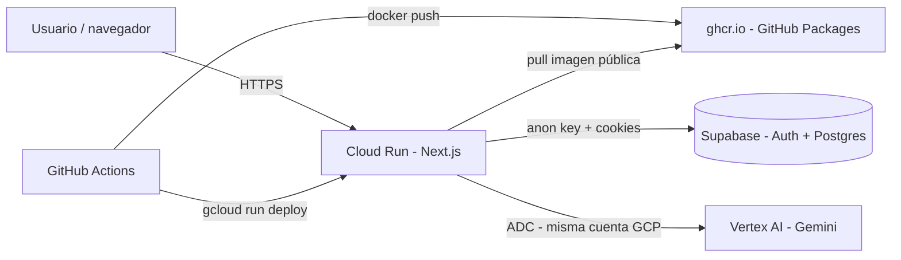

# GCP desde cero — F29 SaaS (Cloud Run + Vertex + GitHub Actions)

Guía para pasar de **0% configurado** a un despliegue coherente con cómo funciona la app hoy y cómo debería quedar en producción.

---

## 1. Cómo encaja todo (qué hace cada pieza)



| Componente | Rol en tu producto |
|------------|---------------------|
| **Cloud Run** | Sirve la app Next.js (`next start` vía imagen **standalone**). Escucha en puerto **3000**. |
| **Supabase** | Sigue **fuera** de GCP: login, RLS, datos. La app solo necesita `NEXT_PUBLIC_SUPABASE_*` (build + runtime). |
| **Vertex AI** | Extracción de PDF/imagen en `POST /api/process-upload`. Usa la identidad de la **cuenta de servicio del servicio Cloud Run** (ADC), no API key. |
| **GitHub Container Registry (ghcr.io)** | Guarda la imagen Docker; **no** usás Artifact Registry en GCP (menos costo y configuración en Google). |
| **GitHub Actions** | En cada push a `main` (cambios en `saas/`), publica la imagen en ghcr.io y despliega en Cloud Run con `gcloud`. |

**Cómo debería funcionar en producción:** proyecto GCP con facturación, APIs necesarias, **región de Cloud Run** alineada con **Vertex** (`VERTEX_LOCATION`), imagen en ghcr.io **pública** (o pull privado con credenciales extra), y la URL de Cloud Run en Supabase Auth.

### ¿Hace falta Artifact Registry?

**No.** Cloud Run puede desplegar desde cualquier registro compatible. Este repo usa **ghcr.io** (incluido en GitHub; para uso razonable suele ser **gratis** o muy barato frente a almacenar imágenes en GCP). Artifact Registry cobra por almacenamiento y operaciones; si preferís todo en GCP, podés volver a un flujo `docker.pkg.dev` y dar a la cuenta de deploy el rol `artifactregistry.writer`.

---

## 2. Checklist rápido (orden sugerido)

1. [ ] Crear **proyecto** GCP y enlazar **facturación** (tus créditos).
2. [ ] Habilitar **APIs** (lista abajo; **sin** Artifact Registry obligatorio).
3. [ ] Crear cuenta de servicio **github-actions-deploy** + JSON → secreto `GCP_SA_KEY`.
4. [ ] Dar a la cuenta **Compute por defecto** el rol **Vertex AI User**.
5. [ ] Cargar **secretos en GitHub** (tabla abajo; ya **no** existe `GCP_ARTIFACT_REGISTRY`).
6. [ ] Push a `main` → **Packages** en GitHub → paquete `f29-saas` → marcar **Public** (necesario para que Cloud Run baje la imagen sin credenciales de ghcr).
7. [ ] Re-ejecutar deploy si hace falta → abrir URL de Cloud Run.
8. [ ] **Supabase** → Auth → Site URL / redirects con la URL de Cloud Run.
9. [ ] Opcional: **presupuesto** y alertas en Billing.

---

## 3. Paso a paso en la consola GCP

### 3.1 Proyecto y facturación

1. Entrá a [Google Cloud Console](https://console.cloud.google.com/).
2. **Select a project → New Project** → nombre legible (ej. `f29-saas`).
3. **Billing → Link a billing account** (donde están tus créditos).

Anotá el **Project ID** (no solo el nombre visible): lo vas a usar en `GCP_PROJECT_ID`.

### 3.2 Habilitar APIs

En **APIs & Services → Library**, habilitá al menos:

| API | Para qué |
|-----|----------|
| **Cloud Run API** | Desplegar el servicio. |
| **Artifact Registry API** | Subir la imagen Docker. |
| **Cloud Build API** | A veces la pide el ecosistema; habilitarla evita sorpresas. |
| **Vertex AI API** | Llamadas a Gemini desde Cloud Run. |
| **IAM Service Account Credentials API** | Uso de identidades de servicio. |

Atajo con `gcloud` (Cloud Shell o máquina con SDK):

```bash
gcloud config set project TU_PROJECT_ID

gcloud services enable \
  run.googleapis.com \
  artifactregistry.googleapis.com \
  cloudbuild.googleapis.com \
  aiplatform.googleapis.com \
  iamcredentials.googleapis.com
```

### 3.3 Elegir región (`GCP_REGION`)

Usá **la misma** región para:

- repositorio de Artifact Registry,
- servicio Cloud Run,
- y como `VERTEX_LOCATION` (el workflow hoy iguala `VERTEX_LOCATION` a `GCP_REGION`).

Ejemplos habituales: `us-central1`, `southamerica-east1`. Verificá en la documentación actual de Vertex qué modelos están disponibles en tu región ([regiones Vertex](https://cloud.google.com/vertex-ai/docs/general/locations)).

### 3.4 Artifact Registry (repositorio Docker)

**Console:** Artifact Registry → **Create repository**

- Format: **Docker**
- Mode: **Standard**
- Location type: **Region** → la misma que elegiste arriba.
- Name: algo corto, ej. `f29-saas` → ese nombre va en el secreto GitHub **`GCP_ARTIFACT_REGISTRY`**.

Equivalente CLI:

```bash
gcloud artifacts repositories create f29-saas \
  --repository-format=docker \
  --location=TU_REGION \
  --description="F29 SaaS images"
```

---

## 4. Cuentas de servicio e IAM (lo que suele fallar si falta)

### 4.1 Cuenta para GitHub Actions (`GCP_SA_KEY`)

**IAM & Admin → Service Accounts → Create**

- Nombre: `github-actions-deploy` (ejemplo).
- Rol **mínimo razonable** (puede ajustarse más fino después):

| Rol (ID) | Motivo |
|----------|--------|
| `roles/run.admin` | Crear/actualizar servicios Cloud Run. |
| `roles/artifactregistry.writer` | `docker push` al repo. |
| `roles/iam.serviceAccountUser` | Actuar como la cuenta de servicio que ejecuta Cloud Run al hacer deploy. |

**Clave JSON:** Service account → **Keys → Add key → JSON**. El archivo completo es el valor del secreto **`GCP_SA_KEY`** en GitHub.

> **Seguridad:** las claves JSON largas son sensibles; cuando puedas, migrá a [Workload Identity Federation](https://github.com/google-github-actions/auth#workload-identity-federation) y eliminá la clave.

### 4.2 Vertex AI desde Cloud Run (ADC)

Cloud Run, por defecto, ejecuta el contenedor con la cuenta:

`PROJECT_NUMBER-compute@developer.gserviceaccount.com`  
(**Default compute service account**)

Esa cuenta debe poder llamar a Vertex:

**IAM → buscá esa cuenta → Grant access → rol:**

- `roles/aiplatform.user` (**Vertex AI User**)

Sin esto, los PDF/imagen fallarán con error de permisos aunque el resto de la app funcione.

### 4.3 Permiso “actuar como” la cuenta de runtime

Si el deploy usa la cuenta por defecto de Compute, la cuenta **github-actions-deploy** necesita **Service Account User** sobre **esa misma** cuenta de Compute (no solo el rol global a veces alcanza según política org). Si `gcloud run deploy` falla con error de impersonación, en IAM agregá a `github-actions-deploy`:

- Principal: la email de `github-actions-deploy@...`
- Rol: `Service Account User` sobre el recurso de la cuenta `{project-number}-compute@developer.gserviceaccount.com`.

---

## 5. Secretos en GitHub (Settings → Secrets → Actions)

| Secreto | Valor |
|---------|--------|
| `GCP_PROJECT_ID` | Project ID de GCP (string corto, ej. `mi-proyecto-123`). |
| `GCP_REGION` | Región, ej. `us-central1`. |
| `GCP_CLOUD_RUN_SERVICE` | Nombre del servicio Cloud Run, ej. `f29-saas` (se crea en el primer deploy). |
| `GCP_ARTIFACT_REGISTRY` | Nombre del repo Docker en Artifact Registry, ej. `f29-saas`. |
| `GCP_SA_KEY` | JSON completo de la cuenta `github-actions-deploy`. |
| `NEXT_PUBLIC_SUPABASE_URL` | URL del proyecto Supabase. |
| `NEXT_PUBLIC_SUPABASE_ANON_KEY` | Anon public key de Supabase. |

El workflow [`.github/workflows/deploy-cloud-run.yml`](../../.github/workflows/deploy-cloud-run.yml) inyecta las variables `NEXT_PUBLIC_*` en el **build** de Docker y las repite en **runtime** de Cloud Run, y fija `GOOGLE_CLOUD_PROJECT` + `VERTEX_LOCATION` para Vertex.

---

## 6. Supabase (fuera de GCP, pero obligatorio para “que funcione”)

1. **Authentication → URL configuration**
   - **Site URL:** `https://TU-SERVICIO-xxxxx.run.app` (la URL que te da Cloud Run tras el deploy).
   - **Redirect URLs:** agregá la misma URL base y, si probás, `http://localhost:3000`.

2. Si usás **RLS** (tu esquema ya lo hace), no hace falta service role en el front: la app usa **anon** + sesión del usuario.

3. **CORS / Auth:** con Site URL correcto, login por email/password y cookies SSR suelen funcionar; si agregás OAuth más adelante, los redirect URIs deben coincidir exactamente.

---

## 7. Después del primer deploy

1. **GitHub → Actions** → abrí el workflow **Deploy Cloud Run** y revisá logs.
2. **Cloud Run → tu servicio → URL** → abrí la app en el navegador.
3. Probá login y una subida **CSV** (no usa Vertex). Luego probá **PDF** (usa Vertex): si falla, revisá:
   - Vertex API habilitada,
   - región del modelo,
   - rol `Vertex AI User` en la cuenta de Compute.

### Variables que la app entiende hoy

| Variable | Dónde | Uso |
|----------|--------|-----|
| `NEXT_PUBLIC_SUPABASE_URL` | Build + runtime | Cliente y servidor Supabase. |
| `NEXT_PUBLIC_SUPABASE_ANON_KEY` | Build + runtime | Igual. |
| `GOOGLE_CLOUD_PROJECT` | Runtime | Vertex (y librerías GCP). Cloud Run lo setea el workflow. |
| `VERTEX_LOCATION` | Runtime | Región del endpoint de Vertex; el workflow lo alinea con `GCP_REGION`. |
| `VERTEX_GEMINI_MODEL` / `GEMINI_MODEL` | Opcional | Si no las ponés, el código usa default `gemini-1.5-flash`. Podés añadirlas al `--set-env-vars` del workflow si necesitás otro ID de modelo en Vertex. |
| `GEMINI_API_KEY` | Opcional | Solo si **no** usás proyecto GCP en el servidor (no aplica a tu deploy actual con Vertex). |

---

## 8. Presupuesto y créditos

**Billing → Budgets & alerts:** creá un presupuesto mensual con alertas al 50 %, 90 %, 100 %.

Con **scale to zero**, Cloud Run no cobra instancias inactivas; el coste principal suele ser **Vertex** (tokens) y algo de **Artifact Registry** + tráfico de red.

---

## 9. Cómo *debería* evolucionar (buenas prácticas)

- **Secret Manager** para valores sensibles y referenciarlos desde Cloud Run con `--set-secrets` en lugar de largos `--set-env-vars` (especialmente si agregás más claves).
- **Workload Identity Federation** en lugar de JSON en GitHub.
- **Dominio propio** + Cloud Run domain mapping + HTTPS administrado.
- **RAM/CPU/concurrency** en Cloud Run ajustados tras mirar métricas (subidas grandes a `/api/process-upload`).
- **Modelo Vertex** fijado a un ID con versión estable en tu región (ej. los que muestre la consola de Vertex) para evitar sorpresas al cambiar defaults.

---

## 10. Referencias útiles

- [Cloud Run docs](https://cloud.google.com/run/docs)
- [Artifact Registry Docker](https://cloud.google.com/artifact-registry/docs/docker/quickstart)
- [Vertex AI generative](https://cloud.google.com/vertex-ai/generative-ai/docs/learn/overview)
- [google-github-actions/auth](https://github.com/google-github-actions/auth)
- Repo: [BenjaminAPR/F29](https://github.com/BenjaminAPR/F29)
