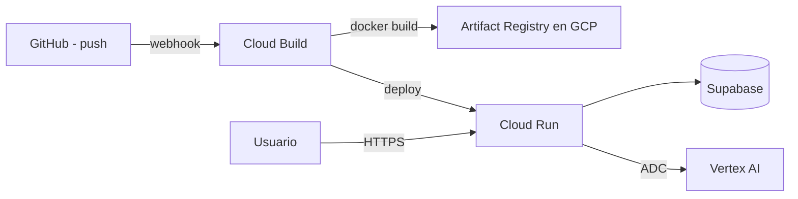

# GCP desde cero — F29 SaaS (Cloud Run + Cloud Build + GitHub)

Guía alineada al flujo **recomendado**: GitHub está **conectado en la consola de GCP**; **Cloud Build** compila con `cloudbuild.yaml` y despliega en **Cloud Run**. **No** hace falta `GCP_SA_KEY` ni workflow de GitHub Actions para eso.

---

## 1. Cómo encaja todo



| Pieza | Rol |
|-------|-----|
| **Cloud Run** | Sirve Next.js (`standalone`). El contenedor debe escuchar en **`PORT`** (Cloud Run suele usar **8080**). |
| **Cloud Build** | Lee `cloudbuild.yaml` en la raíz del repo; construye con `saas/Dockerfile` y contexto `saas`. |
| **Artifact Registry** | Imagen en `…/cloud-run-source-deploy/…` (repositorio que GCP crea o usás para este flujo). |
| **Supabase** | Auth + datos; variables `NEXT_PUBLIC_*` en build y en runtime (ver trigger + Cloud Run). |
| **Vertex AI** | PDF/imagen; la cuenta **Compute por defecto** del servicio necesita **Vertex AI User**. |

---

## 2. Checklist rápido

1. [ ] Proyecto + facturación.
2. [ ] APIs: **Cloud Run**, **Cloud Build**, **Artifact Registry**, **Vertex AI** (ver §3.2).
3. [ ] Cuenta **`…-compute@developer.gserviceaccount.com`**: rol **Vertex AI User**.
4. [ ] Cuenta **Cloud Build** (`...@cloudbuild.gserviceaccount.com`): rol **Artifact Registry Writer** (si falla el push de imagen).
5. [ ] Repo en GitHub con **`cloudbuild.yaml`** en la raíz (monorepo: construye desde `saas/`).
6. [ ] **Cloud Build → Activadores**: trigger conectado al repo; configuración **cloudbuild.yaml**; **sustituciones** `_NEXT_PUBLIC_SUPABASE_URL` y `_NEXT_PUBLIC_SUPABASE_ANON_KEY`.
7. [ ] **Cloud Run → f29** (o tu nombre): **acceso público** (invocador sin auth) para web abierta; variables de entorno `GOOGLE_CLOUD_PROJECT`, `VERTEX_LOCATION`, y las `NEXT_PUBLIC_*` si no van solo en la imagen.
8. [ ] **Supabase Auth**: Site URL = URL `*.run.app`.
9. [ ] Presupuesto / alertas en Billing.

---

## 3. Paso a paso en GCP

### 3.1 Proyecto y facturación

[Console](https://console.cloud.google.com/) → proyecto → **Billing** enlazado. Anotá el **Project ID**.

### 3.2 APIs

Habilitá: **Cloud Run**, **Cloud Build**, **Artifact Registry**, **Vertex AI API**, **IAM Service Account Credentials** (si hace falta).

```bash
gcloud config set project TU_PROJECT_ID
gcloud services enable \
  run.googleapis.com \
  cloudbuild.googleapis.com \
  artifactregistry.googleapis.com \
  aiplatform.googleapis.com \
  iamcredentials.googleapis.com
```

### 3.3 Región

Usá la misma región para Cloud Run, el repositorio `cloud-run-source-deploy` y, si podés, **`VERTEX_LOCATION`** coherente con Vertex ([ubicaciones](https://cloud.google.com/vertex-ai/docs/general/locations)).

El `cloudbuild.yaml` del repo usa por defecto `_REGION: southamerica-west1` y `_SERVICE_NAME: f29` — ajustalos a tu caso en el archivo o con sustituciones en el trigger.

### 3.4 Cloud Build: activador y sustituciones

1. **Cloud Build → Activadores → Conectar repositorio** (GitHub) si aún no está.
2. Editá el activador que despliega **f29**:
   - **Tipo de configuración**: Archivo de Cloud Build en el repo → **`/cloudbuild.yaml`**.
3. **Sustitución de variables** (nombre exacto, con guion bajo inicial):
   - `_NEXT_PUBLIC_SUPABASE_URL`
   - `_NEXT_PUBLIC_SUPABASE_ANON_KEY`

Sin esos valores el build de Next no tendrá Supabase en el cliente.

4. Cada **push** a la rama configurada dispara el build. Revisá **Historial** si falla.

### 3.5 IAM imprescindible

| Cuenta | Rol |
|--------|-----|
| **Default compute** (`PROJECT_NUMBER-compute@…`) | **Vertex AI User** (llamadas Gemini desde Cloud Run). |
| **Cloud Build** (`PROJECT_NUMBER@cloudbuild.gserviceaccount.com`) | **Artifact Registry Writer** + **Cloud Run Admin** + **Service Account User** (sobre la cuenta de ejecución de Cloud Run, si el deploy lo pide). Sin **Cloud Run Admin**, el paso `gcloud run deploy` del `cloudbuild.yaml` falla. |

---

## 4. Cloud Run: tráfico y entorno

- **Permisos / Seguridad:** permití invocaciones **sin autenticación** si la web es pública (o `allUsers` + rol **Cloud Run Invoker**), salvo que quieras solo usuarios IAM.
- **Variables de entorno** recomendadas en el servicio:
  - `GOOGLE_CLOUD_PROJECT` = tu Project ID
  - `VERTEX_LOCATION` = región Vertex (ej. `southamerica-west1`)
  - `NEXT_PUBLIC_SUPABASE_URL` / `NEXT_PUBLIC_SUPABASE_ANON_KEY` (el cliente ya se bakea en build; repetir en runtime ayuda al servidor)

**Puerto:** Next standalone usa `process.env.PORT`. Cloud Run inyecta `PORT` (a menudo **8080**). No hace falta forzar 3000 en Cloud Run si la imagen respeta `PORT`.

---

## 5. Supabase

**Authentication → URL configuration:** Site URL y redirect con `https://TU-SERVICIO….run.app`.

---

## 6. Si algo falla

| Síntoma | Dónde mirar |
|---------|-------------|
| Placeholder de Cloud Run | Build no ok o imagen vieja → **Cloud Build → Historial** y logs. |
| Build falla “no such Dockerfile” | El trigger debe usar **`cloudbuild.yaml`** (usa `saas/Dockerfile`). |
| Push de imagen denegado | **Artifact Registry Writer** en la cuenta **Cloud Build**. |
| PDF/IA falla | **Vertex AI User** en **Compute por defecto**; API Vertex habilitada. |
| 403 al abrir la URL | Falta acceso público / invocador para `allUsers`. |

---

## 7. Presupuesto

**Billing → Budgets:** alertas al 50 % / 90 % / 100 %. Costes típicos: Vertex por uso, Cloud Run por requests/tiempo, almacenamiento de imágenes.

---

## 8. Referencias

- [Cloud Run](https://cloud.google.com/run/docs)
- [Cloud Build](https://cloud.google.com/build/docs)
- [Vertex AI](https://cloud.google.com/vertex-ai/generative-ai/docs/learn/overview)
- Repo: [BenjaminAPR/F29](https://github.com/BenjaminAPR/F29)
